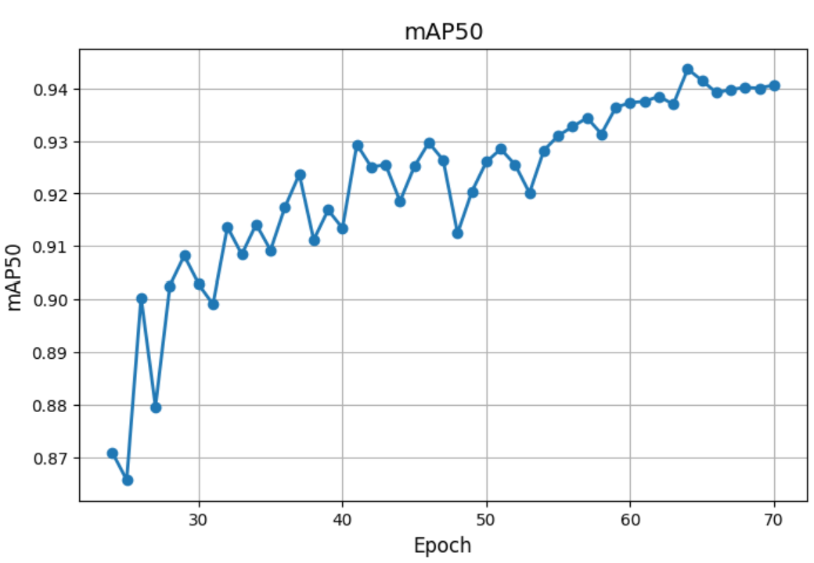
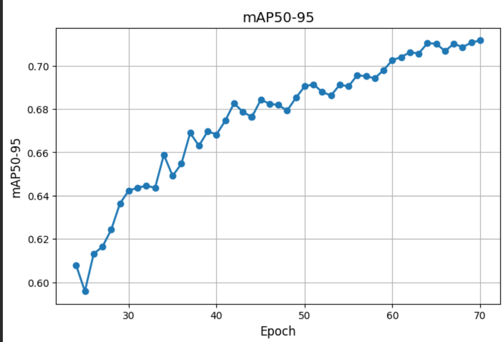

  

<h1 align="center">PPE Monitoring System</h1>
<h3 align="center">Intelligent Computer Vision for Safety Compliance</h3>

  
  
  
  

  
  

---

## 🦺 Overview

This project presents a **real-time PPE Monitoring System** built using advanced **computer vision and deep learning techniques** to automatically detect and monitor **Personal Protective Equipment (PPE)** compliance.

The system is designed as a **general-purpose computer vision solution**, applicable to **industrial, construction, and healthcare environments**, where safety compliance is critical and manual monitoring is inefficient or unreliable.

---

## 🎯 Objectives

- Detect essential PPE items in images and video streams:
  - Helmet
  - Safety Vest
  - Gloves
- Enable **real-time safety compliance monitoring**
- Reduce human-dependent inspection errors
- Support **scalable deployment** on CCTV systems and live video feeds

---

## 🧠 Model & Techniques

- **YOLOv11m** for high-performance real-time object detection
- Custom-curated and balanced PPE dataset
- Robust data augmentation for improved generalization
- Optimized inference for video streams
- Architecture designed for extensibility:
  - Object tracking (BoT-SORT / ByteTrack)
  - PPE violation counting
  - Temporal safety analytics

---

## 🧩 Detected Classes

  

The model detects multiple PPE categories simultaneously using **multi-class object detection**, enabling fine-grained safety assessment at the individual level.

---

## 📊 Performance Metrics

  

  

| Metric | Score |
|------|------|
| mAP@0.5 | **94%** |
| mAP@0.5:0.95 | **72%** |
| Inference Speed | **Real-time** |

**Interpretation:**
- High **mAP@0.5** indicates strong object localization accuracy.
- Competitive **mAP@0.5:0.95** reflects robust performance across stricter IoU thresholds.
- Results demonstrate good **generalization** across varying environments and camera angles.

---

## 🎥 Demonstration

  

▶ **Full demonstration videos:**
- Demo 1 – https://drive.google.com/file/d/1MY4THigeFB4SRbgc7eUDVeyeFZVdKQwo/view
- Demo 2 – https://drive.google.com/file/d/1csQ0PRUyAu-kCCu3DWhlb0KFm2sTcz2B/view
- Demo 3 – https://drive.google.com/file/d/1bVPJCZ43PGx4UfbjaHf9MKRyDDtJJyLx/view
- Demo 4 – https://drive.google.com/file/d/1hEAZULh7gioni81Q85_N2imWBXlMxCwZ/view

---

## 🛠 Tech Stack

- Python
- PyTorch
- Ultralytics YOLO
- OpenCV
- NumPy

---

## 🔬 Use Cases

- Construction site safety monitoring
- Industrial compliance auditing
- Hospital and laboratory safety enforcement
- Smart CCTV and surveillance systems

---
---

## 📜 Intellectual Property & Registration

This project has been officially **registered as a protected software work** with the **Saudi Authority for Intellectual Property (SAIP)**.

The registration covers the system’s:
- Concept and functional design
- Computer vision pipeline
- Model integration and inference workflow
- Application-level implementation

This registration establishes **formal ownership and authorship** of the project while allowing it to be showcased for **research, portfolio, and professional purposes**.

  

> Registration with SAIP reflects the project’s maturity and readiness as a real-world AI system rather than a purely experimental prototype.

## 🌟 Project Status

This project is part of my **Computer Vision and AI portfolio**, focusing on building **deployable, real-world visual intelligence systems**.

> *“AI should not only see — it should protect.”*
