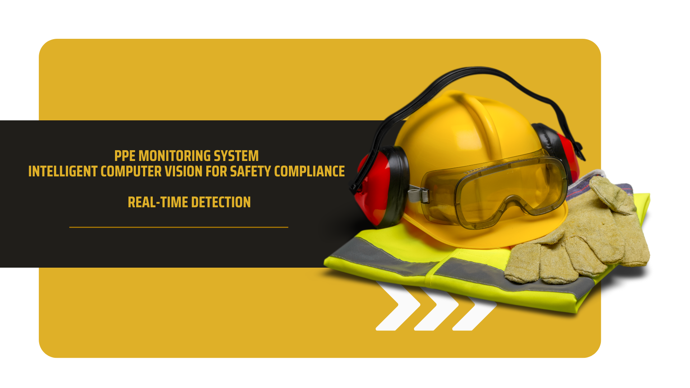

<p align="center">
  
</p>

<p align="center">
  <a href="https://github.com/waseemalmazrua">
    
  </a>
  
  
</p>

---

## 🦺 PPE Monitoring System  
**Intelligent Computer Vision Framework for Safety Compliance Detection**

This project implements a real-time **Personal Protective Equipment (PPE) monitoring system** using deep learning and computer vision techniques to detect safety compliance in industrial and construction environments.

---

## 🎯 Objectives
- Detect safety equipment such as:
  - Helmet
  - Safety Vest
  - Gloves
- Monitor PPE compliance in real-time
- Reduce workplace accidents through automated visual inspection

---

## 🧠 Model & Techniques
- **YOLO (You Only Look Once)** for object detection  
- Trained on a custom PPE dataset  
- Optimized for real-time inference  

---

## 📊 Performance
| Metric | Score |
|------|------|
| mAP@0.5 | **94%** |
| mAP@0.5:0.95 | **72%** |

---

## 🛠️ Tech Stack
- Python  
- Ultralytics YOLO  
- OpenCV  
- PyTorch  

---

## 📂 Project Structure
```text
PPE_Monitoring_System/
│
├── data/
├── models/
├── inference/
├── training/
├── assets/
│   └── banner.png
├── requirements.txt
└── README.md
